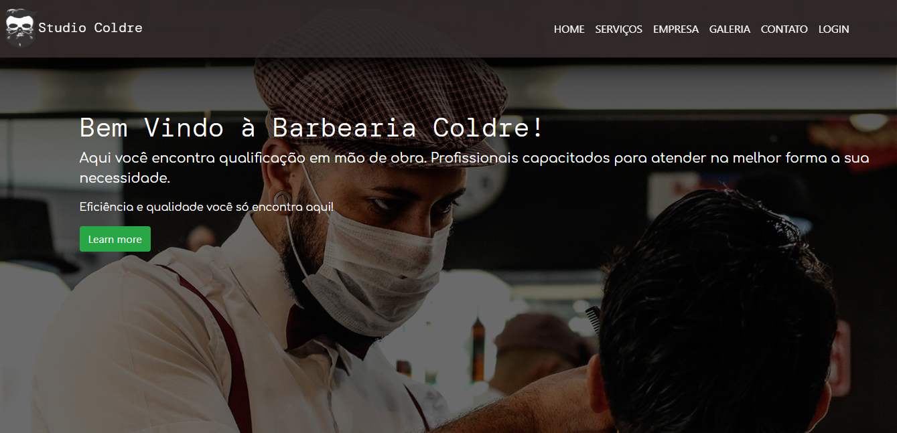

# barberWeb
<h1 align="center">
 
  
 
 
Barber Shop
</h1>

A little description about your project

  

## Features
[//]: # (Add the features of your project here:)
This app features all the latest tools and practices in mobile development!

- ⚛️ **Bootstrap** — Framework front end versão 4.5
- ⚛️ **PHP** — Linguagem de programação. 
- 💹 **XAMPP** — Ferramenta que vem incluso o servidor local com banco de dados mysql

## Getting started

Describe here the way to use/install your project

## License

This project is licensed under the MIT License - see the [LICENSE](https://opensource.org/licenses/MIT) page for details.
